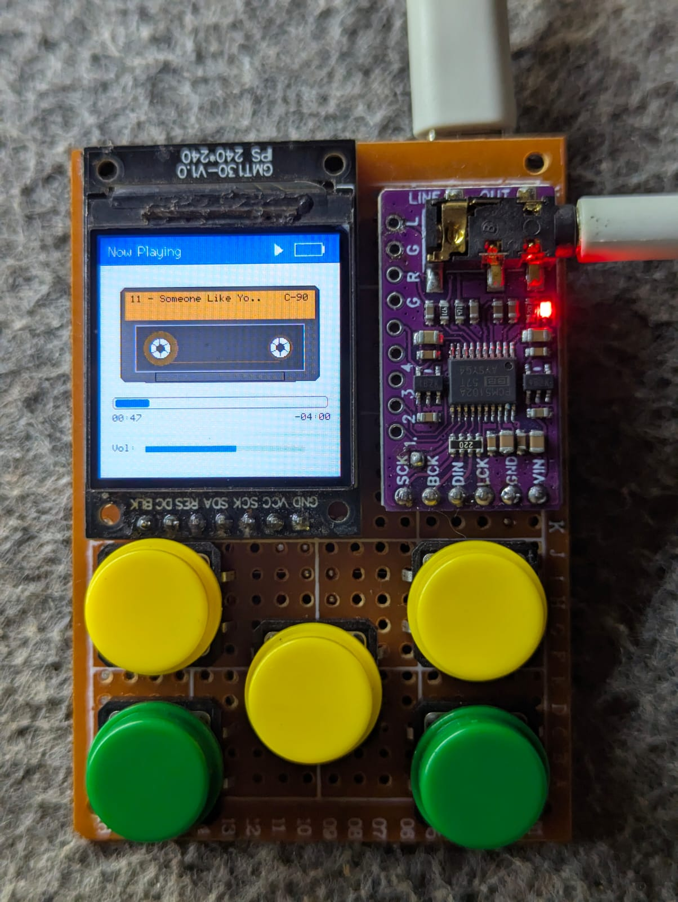
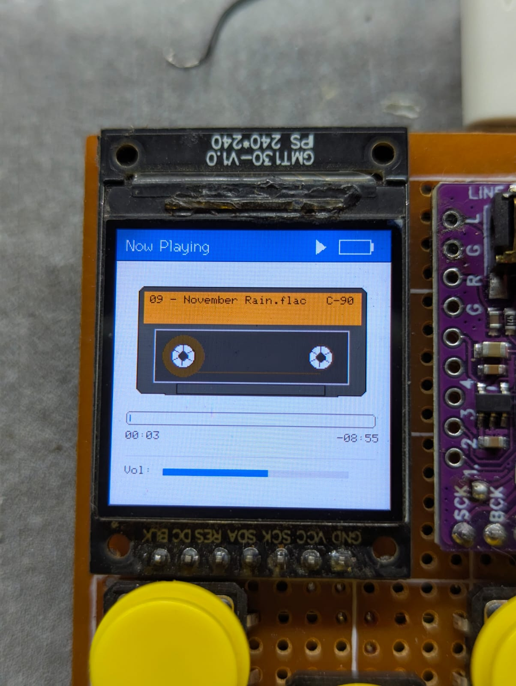
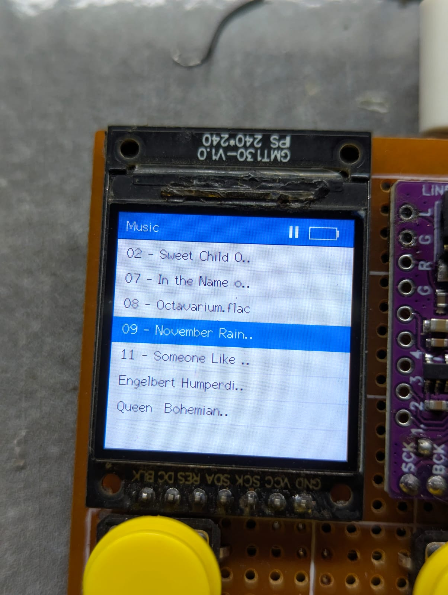
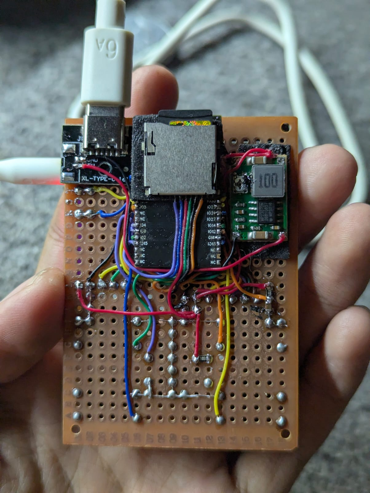

# 🎵 ESPod Audio Player

Proyek pemutar musik portabel berbasis **ESP32** yang mengombinasikan antarmuka UI bergaya **iPod Classic** dan **animasi kaset pita retro** yang berputar secara dinamis. Proyek ini memanfaatkan **FreeRTOS (multithreading)** pada ESP32 untuk memisahkan pemrosesan decoding audio I2S, rendering grafik tampilan, dan penanganan tombol navigasi.

---

<div style="display: flex; gap: 10px;">




</div>

---
## 📸 Fitur Utama

- **Antarmuka UI iPod & Animasi Kaset Retro:**
  - Header bergaya iPod dengan indikator status pemutaran dan persentase baterai.
  - Tampilan visual kaset pita dengan animasi kerek pita (*spool*) yang berputar saat musik diputar.
  - Ketebalan pita kaset menyesuaikan *progress* lagu secara real-time.
- **Arsitektur Multithreading FreeRTOS:**
  - `AudioTask` (Core 1): Menangani decoding I2S dan pembacaan file SD Card secara *real-time*.
  - `UITask` (Core 0): Merender tampilan visual pada Layar TFT tanpa *flicker* menggunakan *PSRAM Sprite*.
  - `InputTask` (Core 0): Menangani deteksi tombol, *debouncing*, *long press*, dan *fast scroll*.
- **Format Audio yang Didukung:** `.mp3`, `.wav`, `.flac`.
- **Fitur Scrubber Mode:** Memudahkan untuk melompat (*fast forward* / *rewind*) durasi lagu sebesar ±5 atau ±10 detik.
- **Penghemat Daya & Manajemen Baterai:**
  - *Auto display off* (Backlight mati otomatis setelah 30 detik tanpa interaksi).
  - Pembacaan kapasitas baterai Li-Ion/LiPo via ADC dengan kalkulasi pembagi tegangan (*voltage divider*).

---

## 🛠️ Hardware & Komponen yang Digunakan

| Komponen | Spesifikasi / Keterangan |
| :--- | :--- |
| **Microcontroller** | ESP32-WROVER (Sangat direkomendasikan modul dengan PSRAM aktif) |
| **Display** | TFT SPI Display 240x240 Pixel (Driver ST7789 / ILI9341 via `TFT_eSPI`) |
| **Audio DAC / Amp** | Modul I2S DAC (misal: MAX98357A / PCM5102A / UDA1334A) |
| **Storage** | Modul MicroSD Card (Interface HSPI / SPI) |
| **Tombol Navigasi** | 5x Push Button (*Tactile Switch*) |
| **Power Supply** | Baterai Li-Ion/LiPo (3.7V - 4.2V) + 2x Resistor 10kΩ (*Voltage Divider*) |

---

## 📌 Pinout & Skema Koneksi

### 1. Modul Audio I2S
| Nama Pin Modul | Pin ESP32 | Keterangan |
| :--- | :--- | :--- |
| **BCLK** (Bit Clock) | `GPIO 26` | Clock sinyal data audio digital |
| **LRCK / WS** (Word Select) | `GPIO 25` | Left / Right Channel Clock |
| **DOUT / SD** (Data Out) | `GPIO 22` | Data Audio Digital Out |

---

### 2. Modul MicroSD Card (HSPI)
| Nama Pin SD Card | Pin ESP32 | Keterangan |
| :--- | :--- | :--- |
| **SD_CS** | `GPIO 15` | SPI Chip Select |
| **SD_MOSI** | `GPIO 13` | SPI Data Input |
| **SD_MISO** | `GPIO 12` | SPI Data Output |
| **SD_SCK** | `GPIO 14` | SPI Clock |

---

### 3. Modul Display ST7789
*(File Konfigurasi Library TFT_eSPI = "User_Setup.h").*

| Nama Display | Pin ESP32 | Keterangan |
| :--- | :--- | :--- |
| **TFT_MOSI** | `GPIO 23` | SPI Data Output |
| **TFT_SCLK** | `GPIO 13` | SPI Clock |
| **TFT_DC** | `GPIO 12` | Data Control |
| **TFT_RST** | `GPIO 14` | Reset Pin |
| **TFT_BL** | `GPIO 14` | Backlight Pin |

---

### 4. Tombol Navigasi (Push Buttons)
*(Semua tombol dikonfigurasi menggunakan internal `INPUT_PULLUP`. Hubungkan salah satu kaki tombol ke Pin ESP32 dan kaki lainnya ke **GND**).*

| Nama Tombol | Pin ESP32 | Fungsi Ringkas |
| :--- | :--- | :--- |
| **BTN_UP** | `GPIO 32` | Ke Atas / Vol + / Fast Forward |
| **BTN_DOWN** | `GPIO 21` | Ke Bawah / Vol - / Rewind |
| **BTN_MENU** | `GPIO 5` | Kembali / Menu Utama / Ke Root Directory |
| **BTN_PLAY** | `GPIO 33` | Play / Pause / On-Off Display Backlight |
| **BTN_CENTER**| `GPIO 0` | Pilih Item / Masuk Scrubber Mode *(Kalau bisa gunakan resistor pullup)* |

---

### 4. Baterai & Control Backlight
| Fungsi | Pin ESP32 | Keterangan |
| :--- | :--- | :--- |
| **PIN_BATTERY** | `GPIO 35` | Pembacaan Analog ADC Baterai (R1 = 10kΩ, R2 = 10kΩ) |
| **TFT_BL** | *(Pin BL Display)* | Kontrol Backlight Display (HIGH = Nyala, LOW = Mati) |

---

## 🕹️ Fungsi & Cara Penggunaan Tombol Navigasi

Sistem bekerja dalam **3 Mode Tampilan (Player State)** yang mengubah fungsi masing-masing tombol:

1. `STATE_MENU_VIEW` (Daftar File & Folder)
2. `STATE_NOW_PLAYING` (Tampilan Layar Pemutar Lagu)
3. `STATE_SCRUBBER_MODE` (Mode Geser Durasi Lagu)

---

### 1. Tampilan Menu (`STATE_MENU_VIEW`)

| Tombol | Aksi / Jenis Tekanan | Fungsi |
| :--- | :--- | :--- |
| **BTN_UP** | Tekan Singkat | Menyorot item menu di atasnya. |
| | Tahan (*Long Press*) | *Fast Scroll* ke atas dengan cepat. |
| **BTN_DOWN** | Tekan Singkat | Menyorot item menu di bawahnya. |
| | Tahan (*Long Press*) | *Fast Scroll* ke bawah dengan cepat. |
| **BTN_CENTER** | Tekan Singkat | Membuka folder yang dipilih / Memutar lagu yang dipilih. |
| **BTN_MENU** | Tekan Singkat | Naik 1 tingkat ke folder di atasnya (*Directory Back*). |
| | Tahan (*Long Press*) | Langsung kembali ke folder utama (*Root Directory `/`*). |
| **BTN_PLAY** | Tekan Singkat | Jika sedang memutar lagu: pindah ke tampilan *Now Playing*. Jika tidak: memutar lagu terlayani. |

---

### 2. Tampilan Now Playing (`STATE_NOW_PLAYING`)

| Tombol | Aksi / Jenis Tekanan | Fungsi |
| :--- | :--- | :--- |
| **BTN_UP** | Tekan Singkat | Menambah Volume Suara (Maksimal Level 21). |
| | Tahan (*Long Press*) | Mengulang lagu dari detik `00:00` (jika durasi > 3 detik) atau ke lagu sebelumnya (*Prev Track*). |
| **BTN_DOWN** | Tekan Singkat | Mengurangi Volume Suara (Minimal Level 0). |
| | Tahan (*Long Press*) | Melompat ke lagu berikutnya (*Next Track*). |
| **BTN_PLAY** | Tekan Singkat | Play / Pause Lagu (*Pause & Resume*). |
| | Tahan (*Long Press*) | Mematikan atau menghidupkan Layar Backlight secara manual. |
| **BTN_CENTER** | Tekan Singkat | Masuk ke **Scrubber Mode** (Mode geser durasi lagu). |
| **BTN_MENU** | Tekan Singkat | Kembali ke Tampilan Menu / Daftar File (`STATE_MENU_VIEW`). |

---

### 3. Mode Scrubber (`STATE_SCRUBBER_MODE`)

| Tombol | Aksi / Jenis Tekanan | Fungsi |
| :--- | :--- | :--- |
| **BTN_UP** | Tekan Singkat | Maju +5 Detik (*Fast Forward*). |
| | Tahan (*Long Press*) | Maju +10 Detik (*Fast Forward* Cepat). |
| **BTN_DOWN** | Tekan Singkat | Mundur -5 Detik (*Rewind*). |
| | Tahan (*Long Press*) | Mundur -10 Detik (*Rewind* Cepat). |
| **BTN_CENTER** | Tekan Singkat | Konfirmasi / Keluar dari Scrubber Mode kembali ke `STATE_NOW_PLAYING`. |

---

### 💡 Catatan Fitur Otomatis
- **Wake-Up Display:** Apabila layar mati otomatis akibat *Timeout 30 detik*, menekan **tombol apapun pertama kali** hanya akan menyalakan kembali backlight layar tanpa mengeksekusi aksi perintah tombol tersebut.

---

## ⚡ Arsitektur Program (FreeRTOS Multithreading)

Program ini membagi beban kerja ke dalam 3 Task FreeRTOS:

1. **`AudioTask` (Core 1, Priority 2):**
   - Menangani pembacaan MicroSD Card dan streaming audio I2S.
   - Melakukan eksekusi pemutaran lagu berikutnya (*auto play next*) secara aman menggunakan *mutex* saat lagu berakhir (Event `evt_eof`).
2. **`UITask` (Core 0, Priority 1):**
   - Mengurus alokasi memory PSRAM Sprite (`TFT_eSprite`) ukuran 240x240.
   - Merender indikator baterai, nama lagu, progress bar, dan animasi kaset yang berputar.
3. **`InputTask` (Core 0, Priority 1):**
   - Membaca state 5 tombol navigasi dengan interval `15 ms`.
   - Mengelola perhitungan waktu *long press*, *fast scroll*, serta penghematan daya backlight.

---

## 📁 Struktur Repositori Kode

```text
.
├── Config.h          # Konfigurasi Pinout, Kode Warna TFT, Structure, & Extern Globals
├── AudioPlayer.h     # Header fungsi dekoder audio I2S dan pembacaan folder SD Card
├── AudioPlayer.cpp   # Implementasi FreeRTOS Task Audio & Callback I2S
├── UIRenderer.h      # Header UI Renderer & Tampilan Layar
├── UIRenderer.cpp    # Implementasi pembacaan ADC Baterai, Sprites, & Drawing UI
├── InputHandler.h    # Header penanganan input tombol
├── InputHandler.cpp  # Logic pembacaan tombol (Short Press, Long Press, Scrubber Mode)
└── main.cpp / .ino   # Setup awal FreeRTOS tasks & Inisialisasi Mutex Semaphore
```

---

## 🚀 Requirement Library

Sebelum mengompilasi kode pada Arduino IDE atau PlatformIO, pastikan library berikut telah terinstal:
1. **[TFT_eSPI](https://github.com/Bodmer/TFT_eSPI)** — Sesuaikan konfigurasi driver layar (misal: ST7789) di file `User_Setup.h` milik library.
2. **[ESP32-audioI2S](https://github.com/schreibfaul1/ESP32-audioI2S)** — Library decoder I2S audio stream.
